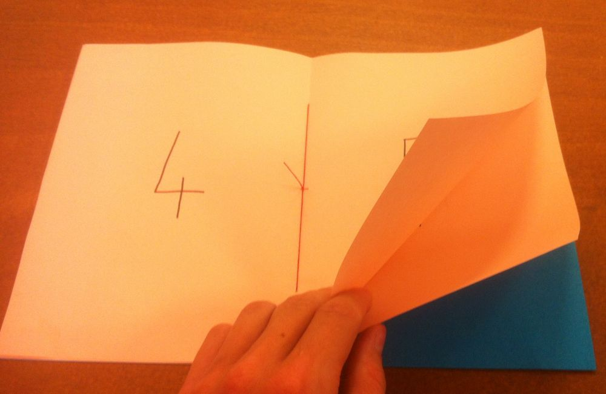
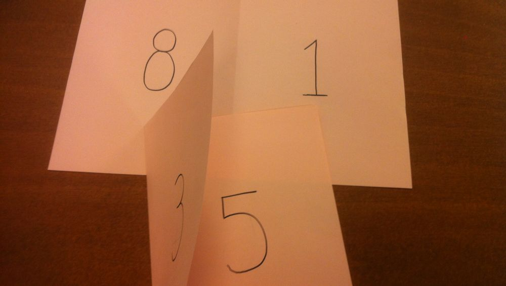
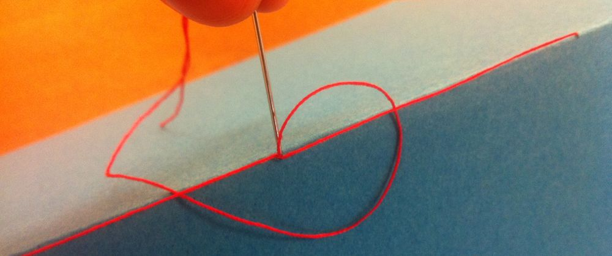

## description
Réaliser un livret A5 à partir de feuilles A4 (vierges, préimprimée ou prédéssinées) relié avec du fil, afin de finaliser une BD, un catalogue, ou un carnet.
Pour faire un livret A4, suivre les mêmes étapes mais utiliser des feuilles A3.

## info atelier
âge recommandé : 8 ans et plus
type d'activité : individuel
difficulté : débutant/intermédiaire
pré-requis : un peu d'agilité (manipulation fil-aiguille)
temps nécessaire : 15 minutes

## liste du matériel
- des feuilles A4
- *recommandé* : des feuilles A4 plus épaisses pour faire une couverture
- un aiguille et du fil
- un outil pointu pour faire des trous
- des ciseaux
- une règle et un crayon à papier

## objectif
- relier plusieurs feuilles A4 ensemble avec du fil pour faire un livret A5.
- voir qu'avec une technique et des matérieux tout simples on peut fabriquer un livret très facilement et donner du cachet à une création de bande déssinée ou impression de petit catalogue ou magazine.

## déroulé
préparation des feuilles
- imprimer ou dessiner sur les feuilles A4 au format paysage tel que pour faire un livret de 8 pages (2 pages recto-verso) il faut :
A4 1
recto (page 8, page 1)
verso (page 2, page 7)
A4 2
recto (page 6, page 3)
verso (page 4, page 5)

- choisir une feuille A4 supplémentaire pour faire office de couverture
- plier toutes les feuilles A4 en deux dans le sens de la largeur, de sorte à avoir un format A5
- regrouper les feuilles, les unes dans les autres, de manière à composer un livret (bien faire attention à l'ordre des pages)

reliure
- ouvrir le livret de feuilles au milieu et marquer d'un point au crayon le milieu du pli, puis rajouter deux autres points le long du pli à envrion 5cm du bord de la feuille.
- en faisant bien attention à ce que les feuilles soient bien alignées les unes sur les autres, percer un trou à l'aide d'un outil pointu sur ces 3 points en traversant bien toutes les feuilles.

- avec une aiguille et environ 40cm de fil commencer par passer dans le trou du milieu par l'intérieur du livret, puis faire un 8 en passant par les deux autres trous et en terminant en repassant par celui du milieu //illu
- passer le fil par dessous les deux boucles extérieur du 8 et repasser par le trou du milieu, bien tendre le tout, puis pour terminer faire un double noeud avec l'autre extrémité du fil resté à l'intérieur

- couper l'excédent de fil en gardant environ 2cm

## conclusion

## rangement
mettre ses chutes de fil à la poubelle et bien ranger les aiguilles
