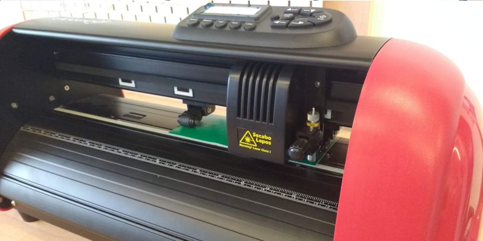
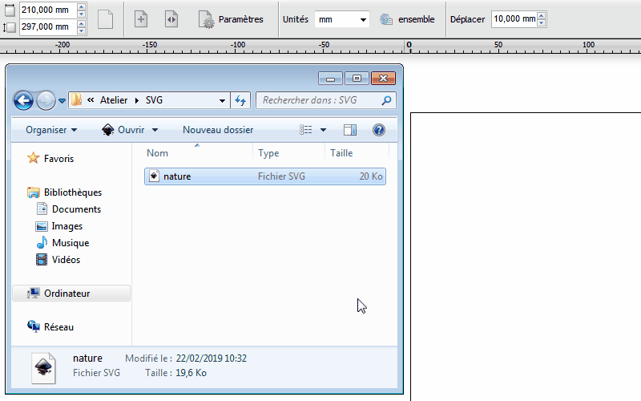
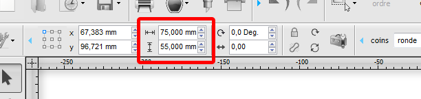
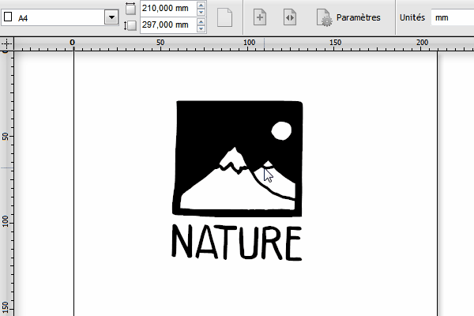
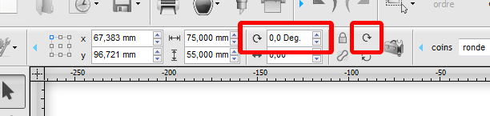
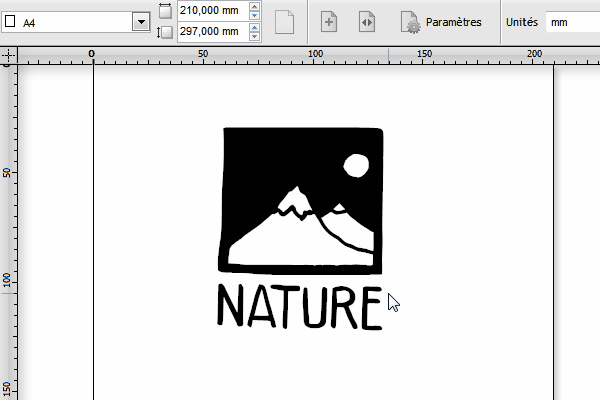
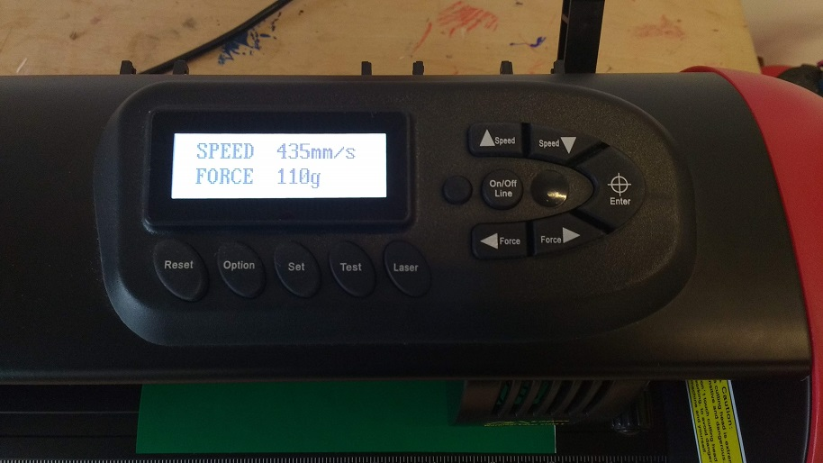
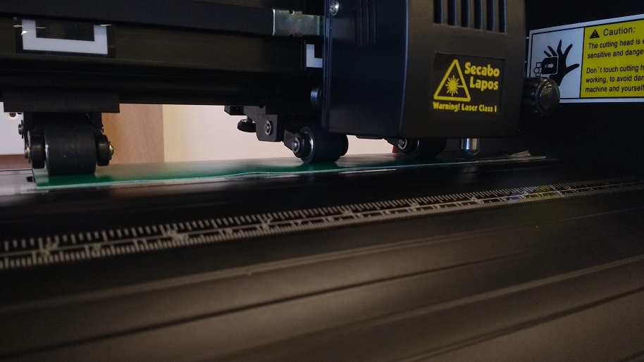
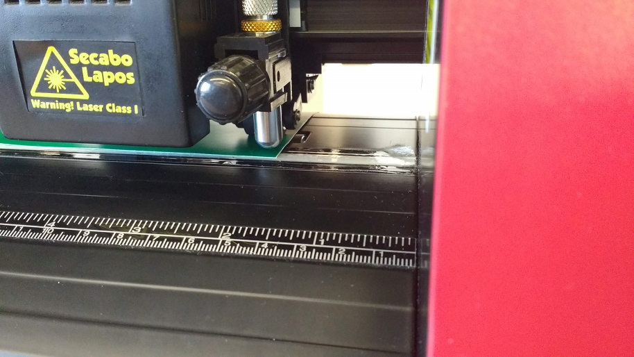
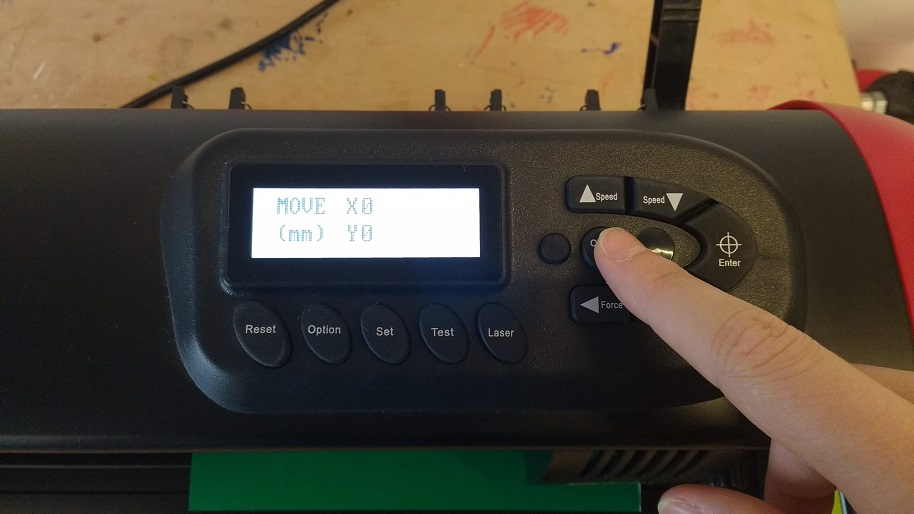

# Guide d'utilisation de la découpeuse

Tout pour savoir comment utiliser la découpeuse !



# Préparation du fichier de découpe

## Obtenir un fichier `.svg`

- via internet
- déjà enregistré sur l'ordinateur
- en le créant sur un logiciel de dessin vectoriel comme **Inkscape**

Pour apprendre à vectoriser un dessin sur Inkscape voir [le tuto vectorisation](vectorisation.md).

## Importer le fichier dans DrawCut

**DrawCut** est le logiciel qui permet à l'ordinateur de communiquer avec la découpeuse.

Importer le fichier `.svg`  dans DrawCut en le glissant-déposant dans l'espace de travail et re-cliquer pour valider.

## Préparation du fichier pour la découpe

### Dimension

Sélectionner le contenu à découper et définir sa dimension en millimètres dans la barre de menu.

Ou redimensionner directement en utilisant le curseur. Bien retenir les dimensions.

### Orientation

Modifier son orientation si besoin.

# Réglages machine

Une fois le fichier bien préparé il reste encore quelques étapes avant de lancer la découpe.

Il  faut s'assurer que tout les réglages au niveau de la machine soit fait  en fonction du type de découpe que l'on souhaite faire : calage du  médium à découper, force et vitesse de découpe et le positionnement de  la lame.

## Réglages pour découpe d'autocollant

Choisir une couleur et prendre un morceau de vinyle de dimensions convenables en prévoyant de la marge. *Se servir en priorité dans le classuer à chutes*. Si il n'y a pas de chutes qui conviennent, découper un morceau dans le rouleau approprié en prévoyant de la marge.

### Insertion du vinyle et calage

Tirer le levier vers le haut et insérer le morceau de vinyle. Placer le de manière à ce qu'il soit :

- sous au moins deux couples roue-rouleau
- parallèle au sens des roues

Quand tout est bien calé, redescendre le levier pour bloquer le vinyle en place.

### Paramètres de découpe

Pour découper dans le vinyle autocollant il est recommandé d'avoir les paramètres suivant :

- Force : 110g
- Speed : peu importe
- Lame recommandée : 30°

## Réglages pour découper du papier

Prendre la feuille de papier et la placer sur la planche de découpe en plastique. *Il ne faut pas mettre une feuille à découper seule sans la planche de découpe !*

### Insertion du papier et calage

Tirer  le levier vers le haut et insérer la planche de découpe ainsi que la  feuille de papier et placer les de manière à ce qu'il soit :

- sous au moins deux couples roue-rouleau
- parallèles au sens des roues

Quand tout est bien calé, redescendre le levier pour bloquer la feuille et la planche.

### Paramètres de découpe

Les paramètres de découpe de la machine varient en fonction de l'épaisseur du papier. On recommande :

| Épaisseur papier                | Force       | Speed        |
| :------------------------------ | :---------- | ------------ |
| papier A4/A3 standard (80g/cm2) | ~ 80g       | 600mm/s ou - |
| papier semi-épais               | 200g à 250g | - de 400mm/s |
| papier épais (carte postale)    | + de 300g   | - de 200mm/s |

Si il y a des problèmes lors de la découpe du papier, réajuster les paramètres.

## Positionnement de la lame

La  découpe du fichier va partir de son coin inférieur droit, ainsi il faut  positionner la lame sur le coin inférieur droit du vinyle ou de la  feuille.

Appuyer sur le bouton `On/Off Line` et utiliser les 4 boutons-flèches pour positionner la lame. Appuyer sur `Enter` pour valider.

# La découpe

Une fois le fichier bien préparé et les réglages de la machine bien au point il ne reste plus qu'une étape avant la découpe.

## Tester la zone avant la découpe

Afin  de s'assurer que la taille de la zone à découper est bonne et que les  réglages sont bons on procède à un test de la zone. Dans DrawCut  sélectionner le bouton découpe (la lame) et cliquer sur `tester la zone`.

![--photo interface de découpe--]

Si  tout est bon on peut passer à la découpe, si non on rectifie les  réglages posant problèmes et on reteste la zone jusqu'à ce que ce soit  bon.

## Découpe

L'étape la plus facile, mais qui demande d'avoir bien fait les précédente. Il suffit de cliquer sur le bouton `découpe sélectionnée` dans DrawCut pour lancer la découpe.

# Récupération de la découpe

### Pour le papier

**Avant de toucher au levier**  s'assurer que la lame à bien coupé à travers le papier. Si non,  repasser un coup de découpe sans bouger la feuille. Ensuite décoller  délicatement la feuille de la planche de découpe et retirer les parties  découpées. Mettre les chutes de papier à la poubelle.

### Pour le vinyle

Récuperer  le vinyle découpé et retirer l'excès à l'aide de ciseaux ou d'un  cutter. Bien identifier votre autocollant, c'est-à-dire, ce qu'il faut  garder et ce qu'il faut retirer pour qu'il ressemble à votre fichier  d'origine.

Retirer ce qu'il y a à retirer *soigneusement*, à l'aide d'un petit outil pointu pour les morceaux les plus petits.

Une  fois que c'est fait il va falloir appliquer un morceau de film  transfert par dessus pour simplifier la pose de l'autocollant. Poser  votre autocollant préparer contre le film et découper autour.

Pour coller l'autocollant il va falloir maroufler pour que l'autocollant colle bien au film de transfert. Retirer *soigneusement*  le film en faisant attention à ce que l'autocollant vienne avec. Une  fois que le film est entièrement retiré avec tout l'autocollant dessus  il ne suffit plus qu'à le coller sur votre support. Le coller en partant  d'un coté à l'autre pour éviter la formation de bulles. Maroufler pour  retirer les bulles et pour bien coller l'autocollant. Retirer le film  en faisant attention à ce que l'autocollant reste bien coller sur votre  support.

# Problèmes fréquents

Il arrive souvent qu'en passant de Inkscape à DrawCut il y ai des problèmes d'importation.

**Si un ou deux éléments mal alignés :** Dans DrawCut utiliser l'outil d'édition de nœuds et sélectionner le  tracé mal placé. Un petit X devrait apparaître vous informant que vous  avez sélectionné un tracé. Déplacer le X pour remettre le tracé à sa  place.

**Si tout est mal aligné :** Dans Inkscape, enregistrer votre création sous un autre nom ou au format svg simple ou svg simplifié.
