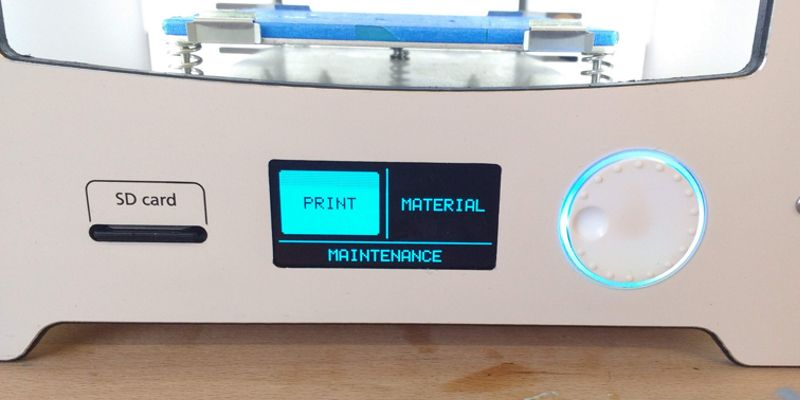
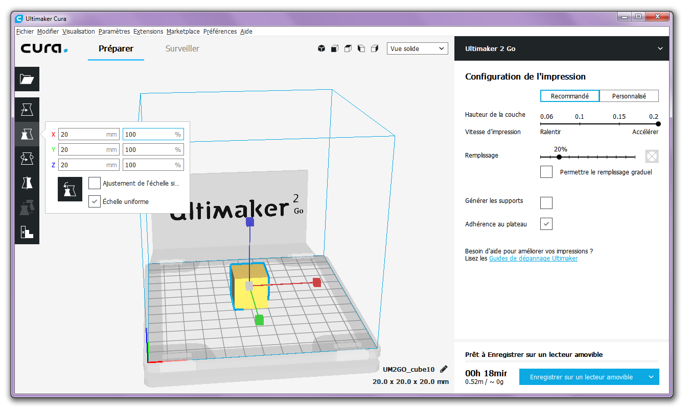
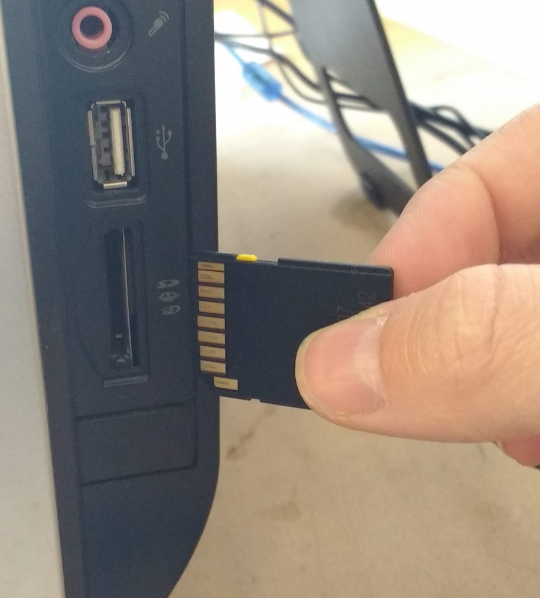
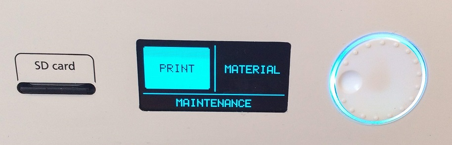

# Guide d'utilisation de l'imprimante 3D

Pour lancer une impression 3D sans problèmes !



# Lancer une impression 3D

## Obtenir un fichier `.stl` ou `.obj`

- via internet
- déjà enregistré sur l'ordinateur
- en exportant un modèle 3D

Pour apprendre à modéliser sa propre création à imprimer voir [le tuto de modélisation 3D](../faire/modelisation.md).

## Préparer le fichier dans Cura

### Option d'impression

Choisir l'échelle de l'objet afin d'obtenir un temps d'impression convenable.

Cocher les options nécessaires :

- générer les supports (pour des structure aérienne)
- adhérence au plateau (pour une meilleure adhérence à la base)

Quand tout les réglages sont bons on peut transférer le fichier préparé du PC à l'imprimante.

## Transférer le fichier sur l'imprimante

Éjecteur la carte mémoire de l'imprimante et l'insérer dans le ordinateur (sur la droite, voir photo)

Cura va prendre quelques seconde à reconnaître la carte mémoire. Sélectionner `enregistrer sur la mémoire amovible`, puis `éjecter`.

## Lancer l'impression

Remettre la carte mémoire dans l'imprimante.

En utilisant la roue de l'interface, sélectionner `PRINT`.

Défiler  jusqu'à trouver le nom du ficher à imprimer (sûrement tout en bas de la  liste). Le sélectionner pour lancer l'impression.

# Impression

L'impression commence par une purge d'environ 20 centimètres de plastique.

Si l'impression ne ressemble pas exactement au modèle cela peut être dû aux [options d'impression] sélectionnées dans Cura (adhérence au plateau et/ou génération de supports).

Quand l'impression est terminée la tête d'impression retourne à sa position par défault et le plateau d'impression redescend.

# Récupérer une impression terminée

Retirer le plateau d'impression avec un outil en métal afin de ne pas se faire mal aux doigts.

![--photo goupilles plaque d'impression--]

Pour décoller l'impression, passer **soigneusement**  une lame fine sous tout le contour de la base. Si l'impression ne se  décolle pas, utiliser un tournevis fin à tête plate pour décoller les  endroits difficile ou hors de porté par la lame.

Si des morceaux de scotch de la plaque d'impression sont trop endommagés (que la surface n'est pas très plate), les remplacer.
