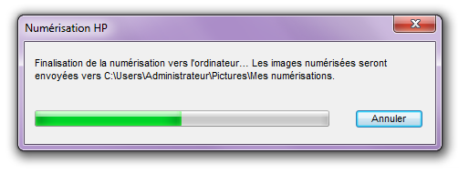

# Guide d'utilisation du scanner

Scanner sans difficultés.

## Numériser un dessin

### Préparation du dessin

Pour  obtenir le meilleur résultat avoir des lignes nettes et bien  contrastées, de préférence au feutre et une feuille non-froissée et  propre.

### Lancer la numérisation

Placer la feuille face contre la vitre du scanner, refermer et appuyer sur le bouton de gauche pour lancer la numérisation.

Sur la fenêtre qui apparaît sur l'ordinateur, sélectionner `photo vers fichier` puis `numériser`.

Choisir un nom pour le fichier (optionnel).

La numérisation peut prendre jusqu'à 1 minute.

### Récupération du fichier sur l'ordinateur

Une fois la numérisation terminée, le fichier enregistré peut être retrouver dans `Mes numérisations` dans le dossier `Images`.

