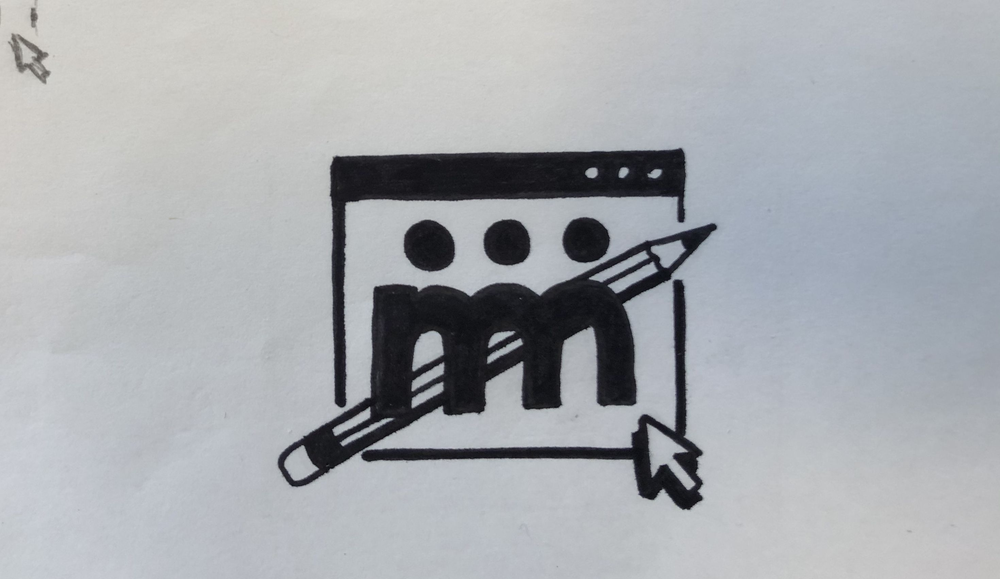

La découpeuse vinyle est un outil utilisé par les professionnels pour faire de la signalétique, des autocollants pour les voitures ou les vitrines de magasins.

Dans ce tuto on voir comment faire un dessin qui va ensuite permettre de guider la lame de la découpeuse pour faire un autocollant.

## Avoir un dessin et le scanner

Faire son dessin au feutre noir sur du papier blanc, pour qu'il se numérise bien et que l'ordinateur puisse bien le reconnaître.

Pour avoir le meilleur résultat suivre ces règles :
- **Dessiner au feutre noir.** *Un dessin au crayon ou de couleurs claires se vectorise mal*
- **Faire un dessin simple.** *Plus il y a de détails plus l'autocollant va être compliqué à découper et à coller.*
- **Bien remplir les zones pleines.** *Une zone mal remplie demandera plus de travail lors de la prochaine étape*
- **Ne pas faire un dessin trop grand.** *Plus le dessin est grand plus il risque d'être complexe. En le  rétrécissant sur ordinateur il risque d'avoir des traits trop fins.*

Une fois le dessin terminé, le scanner et le récupérer sur l'ordinateur.

Pour plus d'info voir le [guide du scanner](../guides/scanner.html).

## Vectorisation sur Inkscape

Ouvrir son dessin dans Inkscape et le mettre dans le bon sens si ce n'est pas déjà le cas.

Le vectoriser en allant dans `chemin` puis `vectoriser un objet matriciel`.

Cliquer sur le bouton mettre à jour pour avoir un aperçu du résultat de la vectorisation. Si le résultat n'est pas correcte, modifier le seuil de luminosité et recliquer sur `mettre à jour` jusqu'à atteindre le résultat souhaité.

Valider et fermer la fenêtre quand le résultat vous convient.

>Il est possible que vous n'arriviez jamais à obtenir le résultat souhaité. Dans ce cas là, trouvez les paramètres qui vous en rapproche le plus, le reste sera à corriger à la main.

Vous pouvez déplacer le dessin vectorisé à coté du dessin scanné d'origine et observer les différences.

Retirer et effacer le dessin d'origine pour faire de la place.

## Nettoyage et modifications

Pour le nettoyage il faut retirer tout ce qui ne doit pas être découpé par la machine. C'est à dire tout les petits points, les poussières qu'il y avait sur la feuille et les traces de crayon ou de feutre qu'on ne veut pas, pour qu'il ne reste que notre dessin.

On peut également en profiter pour corriger les erreurs de vectorisation de notre dessin et modifier certains petits détails pour obtenir un résultat qui nous convient mieux.

Pour nettoyer et modifier notre dessin vectorisé on va utiliser l'outil d'édition de nœuds.

Pour retirer un ou plusieurs points (nœuds) il suffit de les sélectionner et de les supprimer avec la touche `retour arrière` ou `suppr`.

Pour corriger une courbe on peut sélectionner un nœud pour le déplacer et pour modifier la courbe en tirant sur ces poignées ou directement cliquer sur la courbe (entre deux nœuds).

*N'hésitez pas à zoomer pour mieux voir et corriger les erreurs*

>Il est possible d'utiliser l'option `chemin` puis `simplifier` pour réduire le nombre de nœuds de tout notre dessin afin lisser les courbes. Mais cela peut aussi entraîner une perte de finesse et de détails.

Une fois que notre dessin et vectorisé et bien nettoyé il est prêt à être envoyé à la machine pour la découpe.

[//]: # Pour plus d'info sur cette étape voir le [~~guide Inkscape~~]().

Pour les étapes suivante voir le [guide de la découpeuse](../guides/decoupeuse.html).
