Les livres dont vous êtes le héro existe depuis ....
Inklewriter...

[Lien vers l'histoire du tuto.](https://ifwriter.crommer.fr/stories/28)

## L'histoire

Lieux, personnages, actions

Principe de l'écriture interactive (embranchements)

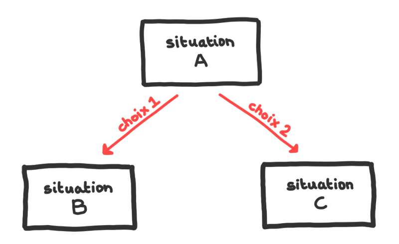

## Faire une carte

Avoir une vision des différents parcours
Faire un schéma, une carte ou un dessin peut aider

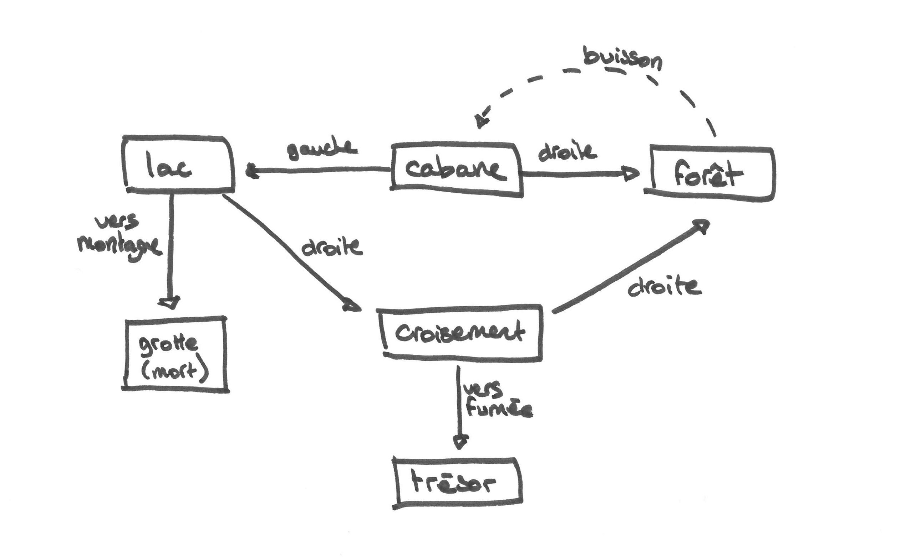

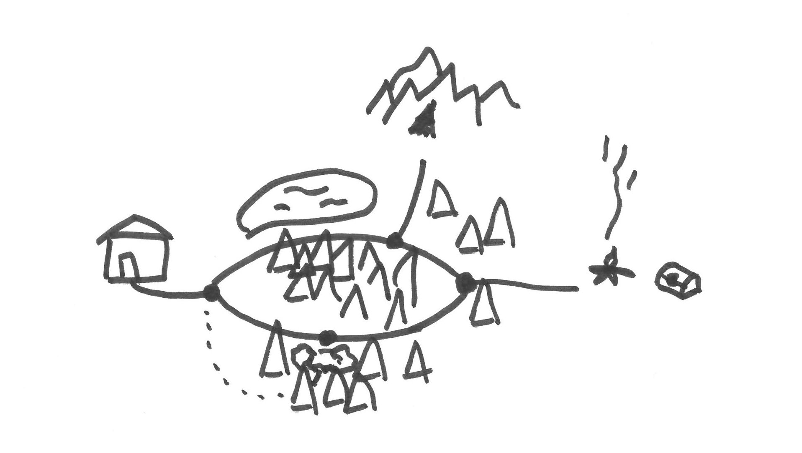

## Écriture

titre + nom auteur

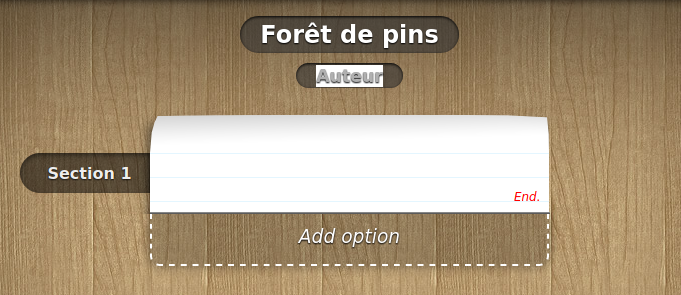

Écrire segment (+ à la ligne)

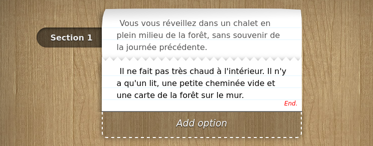

ajouter un choix

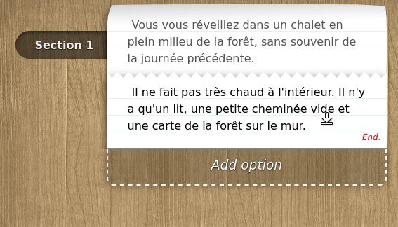

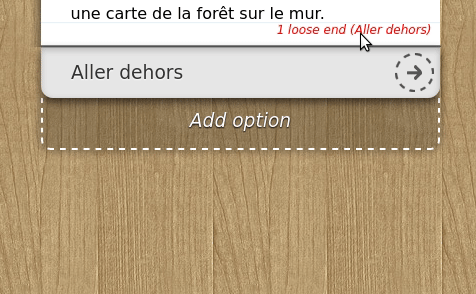

pour défaire le lien, cliquer sur 'unlink'

écrire la suite du choix

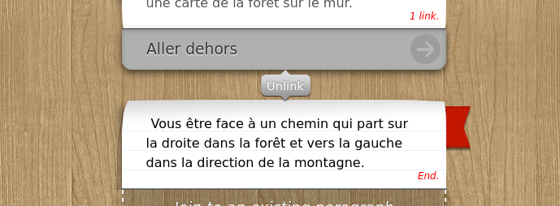

revenir à un paragraphe précédent

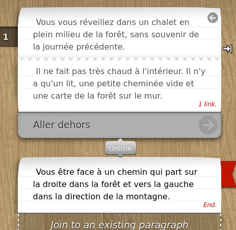

lié a un paragraphe déjà existant + défaire lien (onglet contenu)

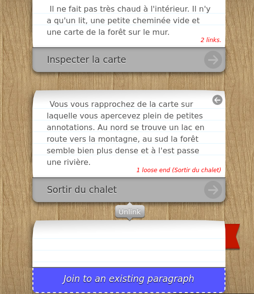

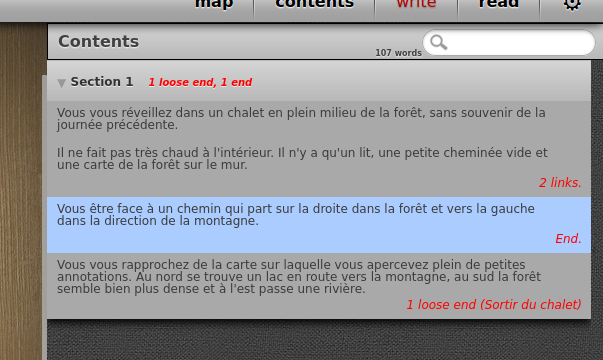

pour ajouter image il suffit de copier le lien vers l'image (qui doit être hébergée sur internet)

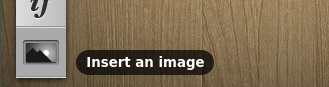

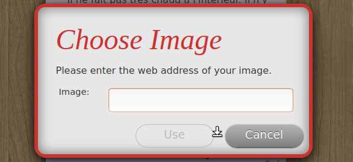

pour passer en mode lecture cliquer en haut à droite sur `read`

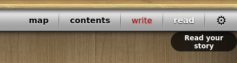

Pour revenir au tout début cliquer sur le flèche, comme en mode écriture.

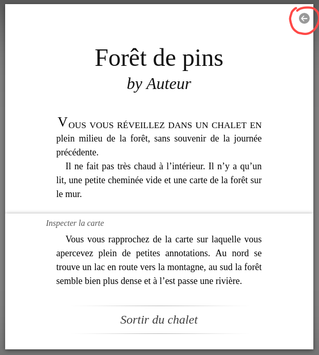

Et voilà.

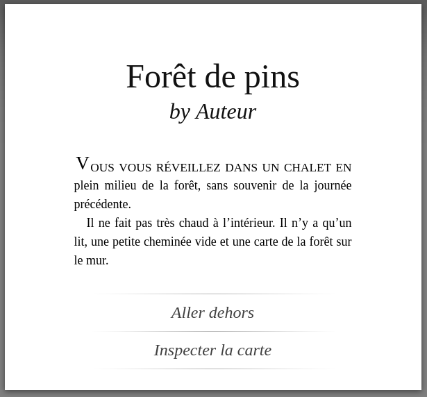

- section
- markers
- logique
