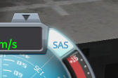

[gif titre explosion KSP]()

[//]: # intro

Dans ce tuto nous allons découvrir l'interface de Kerbal Space Program afin de construire et faire décoller une fusée.

## Présentation du jeu
physique et création de fusées (concepts et ui)

Kerbal Space Program est une jeu de simulation spatiale dans lequel on peut construire des vaisseaux et les faire voler et décoller pour explorer le système solaire (Kerbol)

Dans ce tuto nous créer une nouvelle partie avec le mode de jeu *science*. Après ce tuto vous pourrez tester plus de possibilités dans les autres modes.

La première étape va être de construire une fusée toute simple pour apprendre a utiliser l'interface de construction et de pilotage. Pour cela cliquer sur le gros bâtiment centrale, le *Vehicule Assembly Building* ou l'atelier de construction de fusées.

## Interface de construction
composants, placement et symétrie

L'interface de construction peut paraître un peu complexe mais nous allons y aller étapes par étapes.

## faire une fusée simple
contrôle, carburant et réacteur

En premier placer le cockpit.

Ensuite dans le troisième onglet, prendre un réacteur et l'attacher au cockpit.

Dernier petit détail avant notre premier décollage, il faut aussi rajouter un parachute au dessus de cockpit.

Pour que le parachute **ne se déclenche pas en même temps** que le réacteur au décollage il va falloir créer une étape supplémentaire dans le coin en bas à droite. Cliquer sur le `+` et placer le réacteur dans le `1` et le parachute dans le `0`.

Tout est prêt pour notre tout premier décollage ! Pour partir sur la zone de lancement cliquer sur le bouton vert en haut à droite.

## interface de vol et premier décollage
commandes, trajectoire et carte

Les commandes de pilotage sont :

Avant de décoller appuyer sur la touche `t` pour activer le système automatisé de stabilisation du vaisseau ou SAS qui le rend plus facile à contrôler.

Pour déclencher la première étape et décoller il faut appuyer sur la `barre espace`.

Comme vous pouvez le voir, notre vaisseau n'est pas suffisamment puissant pour aller dans l'espace ou orbiter notre planète. Mais on peut en profiter pour regarder notre trajectoire dans la carte du système en appuyant sur la touche `m`. Il est fort possible qu'on ai besoin de zoomer pour bien la voir, l'espace c'est très grand.

Il nous faut encore un peu plus d'énergie pour pouvoir aller et rester dans l'espace.

Mais avant de retenter notre chance il va falloir atterrir. Pour déployer notre parachute il faut déclencher la prochaine étape de notre fusée avec la `barre espace`. **Attention, si le vaisseau va trop vite le parachute peut brûler !**

Pour accélérer le temps lors de la descente cliquer sur les flèches en haut à gauche.

Dans le pire des cas vous avez explosé (ça arrive beaucoup dans KSP).

Et dans le meilleur des cas vous avez réussi à regagner la surface de Kerbin. Mais avant de rentrer au centre spatiale nous allons apprendre à récolter des points de science pour pouvoir développer de nouvelles technologies !

## récolter et dépenser des points de science

 crew report
 
 

 eva (activité extra véhiculaire) + surface sample

 rerentrer dans la fusée avec la touche `B`

 retour au centre et pour dépenser nos points de science

  avec tout ça on devrait avoir assez de science pour découvrir de nouvelles technologies.

  Pour dépenser ses points de science il faut aller dans le bâtiment de Recherche et Développement.

  

  Dans le batîment vous pouvez voir l'avancé de votre recherche. Nous allons débloquer les deux prochains bloc de techno.

  

## fusée plus complexe
séparateurs et fusée en plusieurs étapes

## orbite
concept, trajectoire, points de manœuvres et retour sur Kerbin
