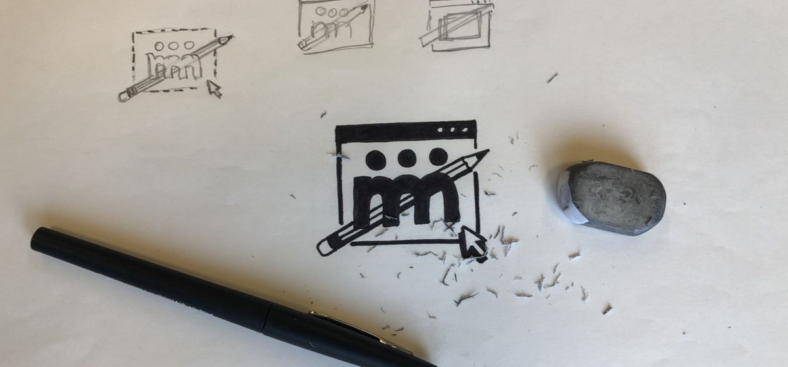
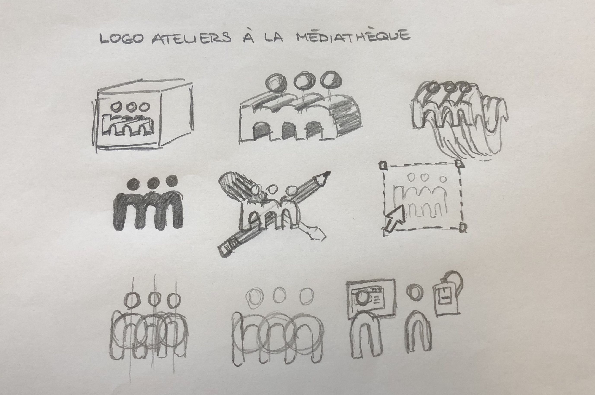
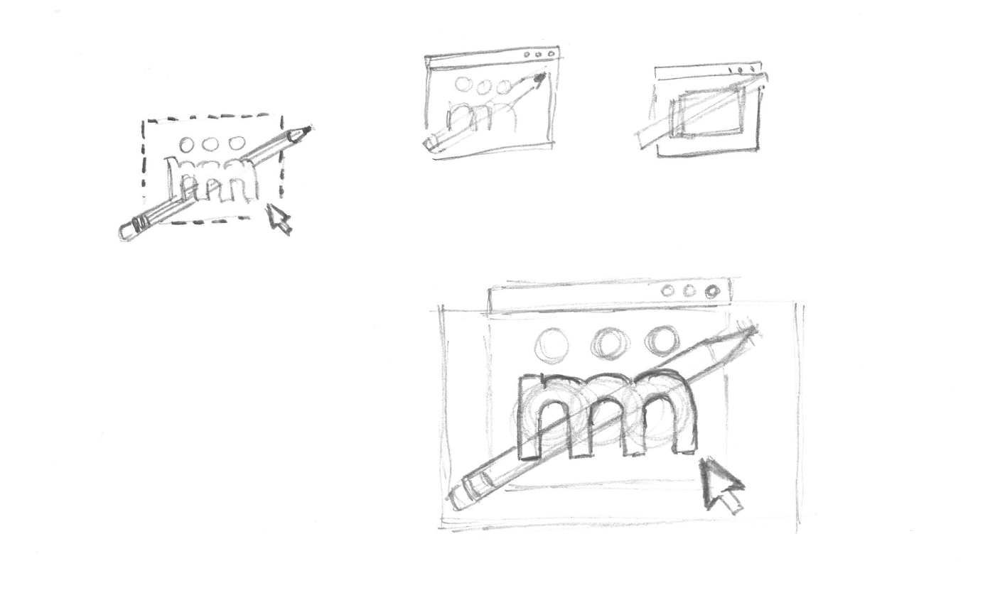
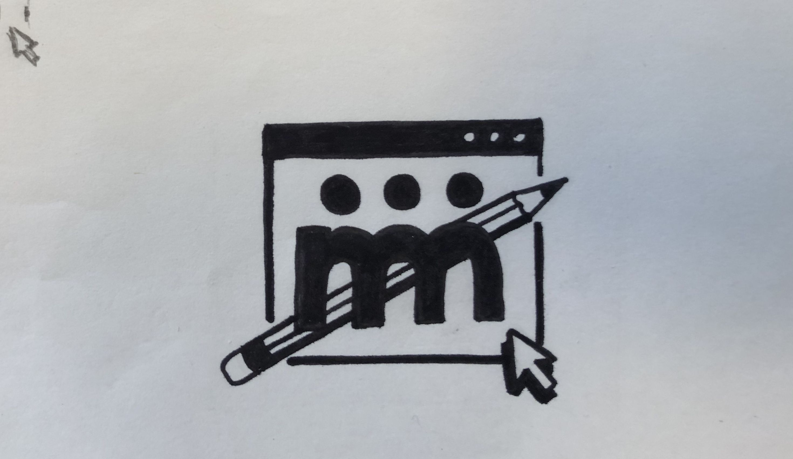

[//]: # intro

Dans ce tuto nous allons créer notre propre logo en partant de croquis.

## Caractéristiques d'un bon logo

Avant de commencer à dessiner il est bon de savoir ce qui fait un bon logo.
Un logo est :
- simple et lisible
- reconnaissable car pas comme les autres
- facile à mémoriser

## Dessiner des idées

Faire des croquis de plein d'idées différentes qui vous passe par la tête.

Le but n'est pas de faire de jolie dessins mais de faire une liste d'idées sous forme de croquis. Ne pas passer plus de 2 minutes sur chaque idées.

## Choix et approfondissement

Choisir parmi les idées dessinées celle qui vous plaît le plus. Approfondir cette idée en passant plus de temps à la dessiner et en gardant en tête les caractéristiques d'un bon logo.

## Mettre au propre

Maintenant il ne reste plus qu'à dessiner notre logo au propre avec un feutre noir.

Pour apprendre comment faire un autocollant à partir d'un dessin, voir [ce tuto](autocollant.html)
