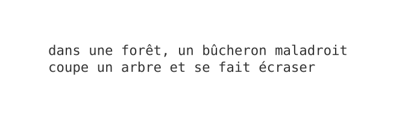
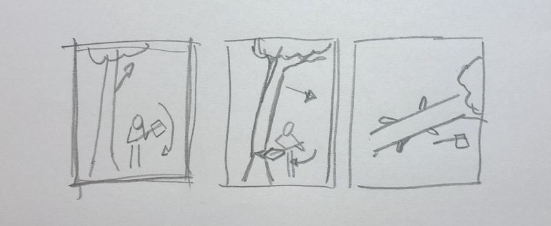
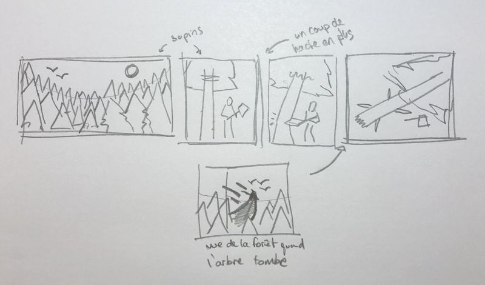
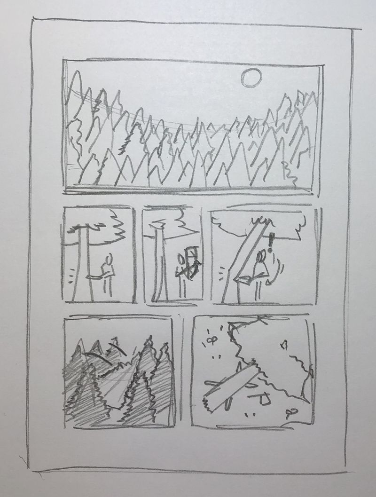

Le storyboard est une technique utilisée partout dans le monde de la création : pour la bande dessinée, dans le tournage de films et de séries et même pour la création de vidéos sur youtube/internet.

En partant d'un script, le storyboard sert à faire le plan des images à dessiner ou filmer.

Dans ce tuto nous allons voir comment on peut utiliser cette technique pour plannifier les dessins d'une planche de bande dessinée.

## L'histoire

Pour commencer notre storyboard il faut un script ou alors imaginer une histoire à raconter.

Des éléments utiles à avoir dans son script : le lieu, l'ambiance, les personnages, les actions.

## Découpage en cases

Une fois qu'on a une histoire à raconter il faut la découper en cases en faisant des croquis rapides. Le but n'est pas de faire de jolies dessins mais de faire un plan de tout ce qu'il va falloir prendre le temps de dessiner plus tard.

Il faut découper notre histoire en **au moins trois cases** pour bien comprendre :
- Le contexte (ou la situation initiale) : Où et quand se passe notre histoire et avec qui ?
- L'action (ou la péripétie) : Qu'est ce qu'il se passe ?
- Le dénouement (ou la situation finale) : Comment ça se termine ?

Prendre un crayon de papier et une feuille et faire des croquis rapides des différentes cases.

## Réajustement des cases

Maintenant qu'on a nos premiers croquis de dessinés on peut les regarder et se demander si on peut améliorer notre storyboard. On peut rajouter des cases pour raconter plus de choses, diviser une case en plusieurs petites cases pour mieux décrire des moments d'action ou de dialogue, ou même supprimer des cases qu'on ne trouve pas utile.

Prendre une autre feuille et recommencer à zéro s'il le faut.
Quand le nouveau storyboard est fait, reprendre le temps pour le regarder et voir s'il vous convient, si non continuez à ajuster les cases.

*N'hésitez pas à mettre des flèches ou des annotations pour mieux comprendre ce que doivent raconter les cases.*

## Adaptation au format

Dans la continuité de l'étape précédente, il va falloir adapter nos cases au format de page de notre bande dessinée. Soit A4 (papier standard d'imprimante) ou A5 (feuille A4 pliée en deux) ou autre.

Il faut répartir nos cases sur la ou les feuilles de notre bande dessinée.

Toutes nos cases n'ont pas besoin d'avoir la même taille. On peut en avoir des grandes qui prennent toute ou la moitié de la page et des toutes petites qui montrent juste des petits détails.

Maintenant que notre storyboard est terminé on peut passer à l'étape du dessin puis de la couleur.
