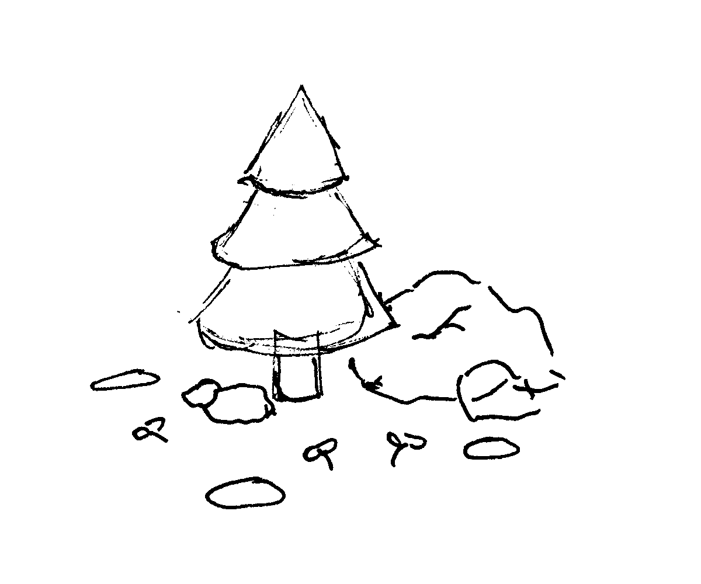
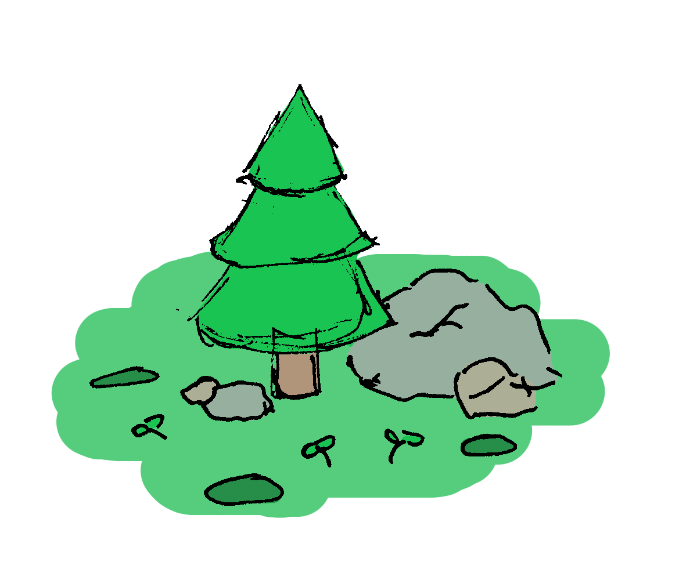
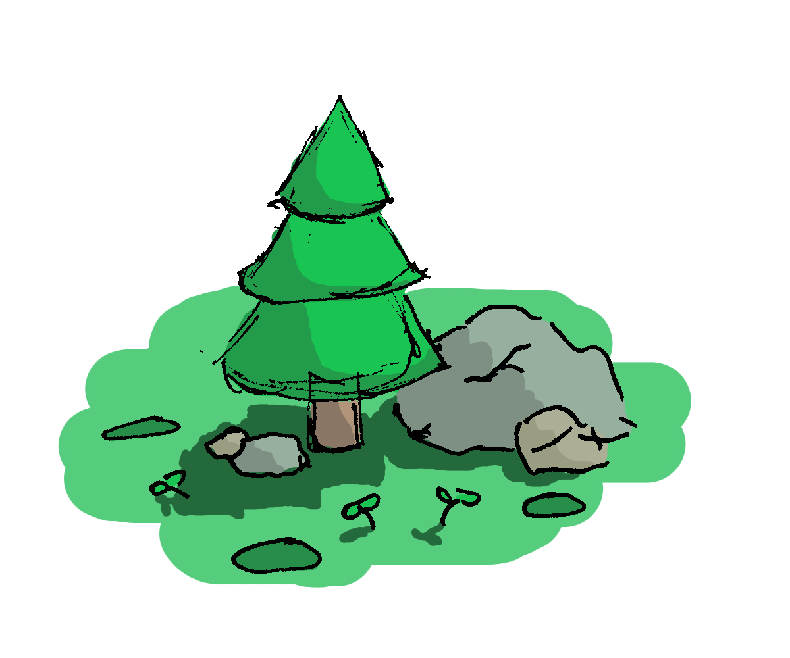
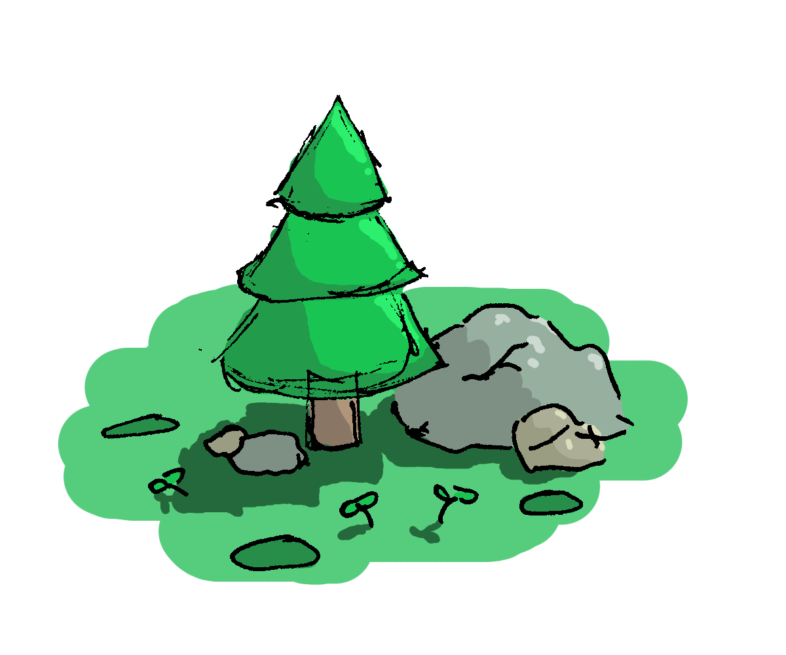
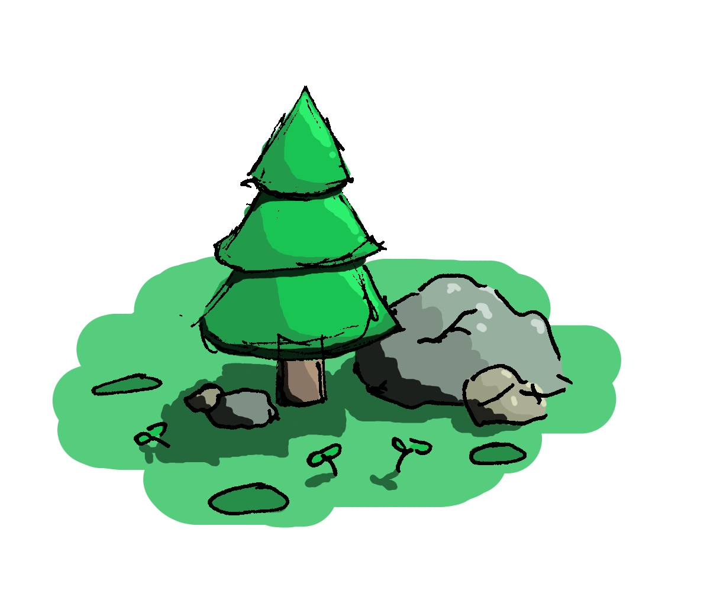

## description
En utilisant un ordinateur, ajouter de la couleur à une planche de BD déjà scannée en noir et blanc.
// peut également se faire dans la continuité d'un atelier précédent de dessin.

## info atelier
âge recommandé : 10 ans et plus
type d'activité : seul sur son travail
difficulté : débutant/intermédiaire
pré-requis : avoir déjà manipulé un ordinateur
temps nécessaire : 1 à 2 heures

## liste du matériel
- ordinateur
- logiciel de dessin (notre choix : [Krita](https://krita.org/fr/))
- clavier et souris
en option : tablette graphique ou écran tactile

## objectif
- réaliser la colorisation d'une planche de BD et pouvoir repartir avec
- prendre en main un logiciel de dessin numérique et découvrir ces différents outils et concepts : le pot de peinture, les pinceaux , la sélection de couleurs, les calques et sauvegarder son travail

## déroulé
- choisir une planche déjà scannée qui nous plaît. (avoir la version papier) //parler de droit d'auteur
- ouvrir et présenter le logiciel et ses concepts de bases (outils, sélection de couleurs, claques) et rappeler des raccourcis claviers de bases (si besoin fournir fiche accompagnement ordinateur)

- ouvrir la planche numérisée et créer un autre calque pour y ajouter de la couleur sans écraser la planche
- commencer par des aplats de couleurs simples (ex: ciel en bleu, montagnes en gris, arbres en verts etc.)

- puis ajouter du volume et de la profondeur avec des variantes claires et foncés des couleurs déjà posées (ex : verts foncés pour l'ombre des arbres et vert ou même jaune pour le coté à la lumière, etc.)

- si besoin ajouter des touches de noir pour appuyer des zones sombres et du blanc pour les endroits très clairs

## conclusion
on voit qu'un dessin est découpé en plusieurs étapes et qu'il se fait progressivement. Même en se focalisant sur la couleur seulement, on commence par un premier passage grossier et on affine au fur et à mesure.

## rangement
bien sauvegarder son travail dans le dossier approprié avec un nom qui permet de facilement identifier notre création. exemple : "BD alexandre planetes"

//retour fiche
image d'exemple de résultat en tête de fiche
ajouter mini illus de certaines étapes très visuels
lien vers ressources
